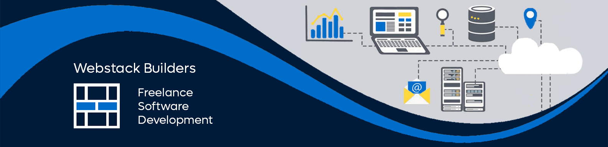
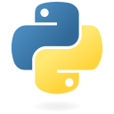
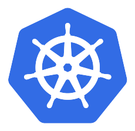
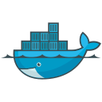
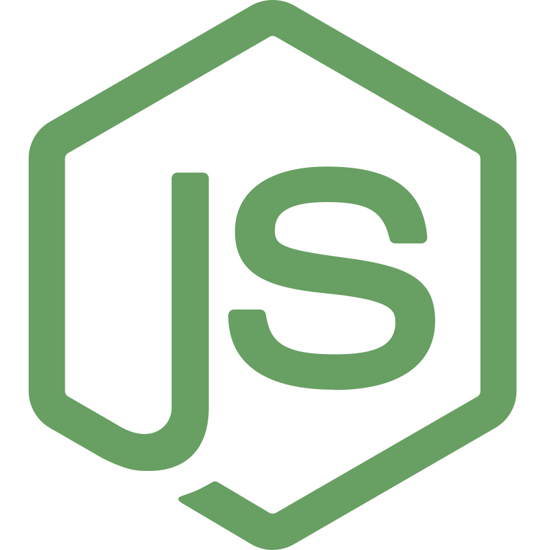
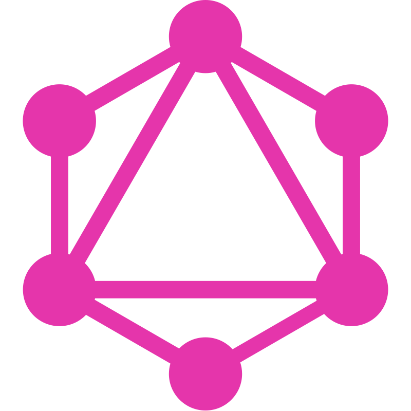
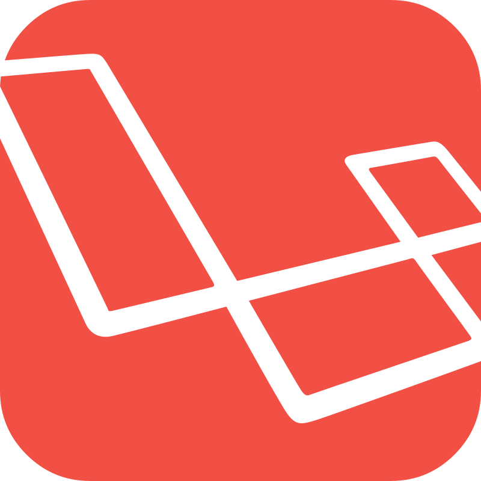

[](https://webstackbuilders.com)


```python
#!/usr/bin/python
# -*- coding: utf-8 -*-

class SoftwareEngineer:

    def __init__(self):
        self.name = "Kevin Brown"
        self.role = "Software Engineer"
        self.desc = """
          Experienced freelance developer with a strong focus on improving developer experience and delivering software efficiently. Highly skilled in various programming languages and technologies."""

    def say_hi(self):
        print(self.desc)

me = SoftwareEngineer()
me.say_hi()
```

## Tech Stack

<table>
  <tr><td align="center" width="96">
      
      <br>Golang
    </td><td align="center" width="96">
      
      <br>TypeScript
    </td><td align="center" width="96">
      
      <br>Python
    </td><td align="center" width="96">
      
      <br>Kubernetes
    </td><td align="center" width="96">
      
      <br>Docker
    </td><td align="center" width="96">
      
      <br>Debian
    </td><td align="center" width="96">
      
      <br>Grafana
    </td><td align="center" width="96">
      
      <br>Node
    </td><td align="center" width="96">
      
      <br>React
    </td><td align="center" width="96">
      
      <br>Sass
    </td><td align="center" width="96">
      
      <br>AWS
    </td><td align="center" width="96">
      
      <br>GraphQL
    </td><td align="center" width="96">
      
      <br>Laravel
    </td></tr>
</table>

## Work Experience

<table><tr>
    <td style="vertical-align: top;">
      
    </td>
    <td>
      ### Software Developer
      **Webstack Builders** • Freelance
      <p><strong>Languages &amp; Technologies:</strong> TypeScript, Node, React, Express, Laravel, AWS, React Native, Gatsby, Next, Redwood, Storybook, Mocha, Jest, Playwright, GraphQL, REST, Sanity, Contentful, Drupal, Node native extensions (Gyp/C++/libuv/V8)</p>

    </td>
  </tr><tr>
    <td style="vertical-align: top;">
      
    </td>
    <td>
      ### System Analyst
      **Eli Lilly** • Full-Time
      <p><strong>Languages &amp; Technologies:</strong> Microsoft Project, Microsoft Excel, SharePoint, .NET, C#</p>

    </td>
  </tr><tr>
    <td style="vertical-align: top;">
      
    </td>
    <td>
      ### Infrastructure Engineer
      **Alento, Inc.** • Full-Time
      <p><strong>Languages &amp; Technologies:</strong> OpenStack, Docker, BGP, OSPF, VLAN, Cisco IOS, RHEL, Debian, KVM, QEMU, OpenBSD, Jenkins, BASH, Python, Nagios, Squid, Postfix, OpenLDAP, SOAP, gRPC</p>

    </td>
  </tr></table>

See [here](https://resume.webstackbuilders.com) for my detailed resume.

### Projects and Dev Stuff

<details>
  <summary><b>🛠️ My Favorite Tools</b></summary>
  <br>
  ### 👨‍💻 Programming and Markup Languages
  <br>[]("https://github.com/search?q=user%3Awebstackdev+language%3AMIPS Assembly")[]("https://github.com/search?q=user%3Awebstackdev+language%3A")[]("https://github.com/search?q=user%3Awebstackdev+language%3A")[]("https://github.com/search?q=user%3Awebstackdev+language%3Acpp")[]("https://github.com/search?q=user%3Awebstackdev+language%3A")[]("https://github.com/search?q=user%3Awebstackdev+language%3A")[]("https://github.com/search?q=user%3Awebstackdev+language%3A")[]("https://github.com/search?q=user%3Awebstackdev+language%3A")[]("https://github.com/search?q=user%3Awebstackdev+language%3Atex")[]("https://github.com/search?q=user%3Awebstackdev+language%3A")[]("https://github.com/search?q=user%3Awebstackdev+language%3A")[]("https://github.com/search?q=user%3Awebstackdev+language%3A")[]("https://github.com/search?q=user%3Awebstackdev+language%3A")[]("https://github.com/search?q=user%3Awebstackdev+language%3A")[]("https://github.com/search?q=user%3Awebstackdev+language%3A")[]("https://github.com/search?q=user%3Awebstackdev+language%3A")[]("https://github.com/search?q=user%3Awebstackdev+language%3A")[]("https://github.com/search?q=user%3Awebstackdev+language%3A")### 🧰 Frameworks and Libraries
  <br>[]("https://github.com/search?q=user%3Awebstackdev+language%3A")[]("https://github.com/search?q=user%3Awebstackdev+language%3A")[]("https://github.com/search?q=user%3Awebstackdev+language%3A")[]("https://github.com/search?q=user%3Awebstackdev+language%3A")[]("https://github.com/search?q=user%3Awebstackdev+language%3A")[]("https://github.com/search?q=user%3Awebstackdev+language%3A")[]("https://github.com/search?q=user%3Awebstackdev+language%3A")[]("https://github.com/search?q=user%3Awebstackdev+language%3A")[]("https://github.com/search?q=user%3Awebstackdev+language%3A")[]("https://github.com/search?q=user%3Awebstackdev+language%3A")[]("https://github.com/search?q=user%3Awebstackdev+language%3A")[]("https://github.com/search?q=user%3Awebstackdev+language%3A")[]("https://github.com/search?q=user%3Awebstackdev+language%3A")[]("https://github.com/search?q=user%3Awebstackdev+language%3A")[]("https://github.com/search?q=user%3Awebstackdev+language%3A")[]("https://github.com/search?q=user%3Awebstackdev+language%3A")[]("https://github.com/search?q=user%3Awebstackdev+language%3A")[]("https://github.com/search?q=user%3Awebstackdev+language%3A")[]("https://github.com/search?q=user%3Awebstackdev+language%3A")### ☁️ Cloud Hosting
  <br>[]("https://github.com/search?q=user%3Awebstackdev+language%3A")[]("https://github.com/search?q=user%3Awebstackdev+language%3A")[]("https://github.com/search?q=user%3Awebstackdev+language%3A")[]("https://github.com/search?q=user%3Awebstackdev+language%3A")[]("https://github.com/search?q=user%3Awebstackdev+language%3A")[]("https://github.com/search?q=user%3Awebstackdev+language%3A")[]("https://github.com/search?q=user%3Awebstackdev+language%3A")### 🗄️ Databases
  <br>[]("https://github.com/search?q=user%3Awebstackdev+language%3A")[]("https://github.com/search?q=user%3Awebstackdev+language%3A")[]("https://github.com/search?q=user%3Awebstackdev+language%3A")[]("https://github.com/search?q=user%3Awebstackdev+language%3A")[]("https://github.com/search?q=user%3Awebstackdev+language%3A")### 💻 Software and Tools
  <br>[]("https://github.com/search?q=user%3Awebstackdev+language%3A")[]("https://github.com/search?q=user%3Awebstackdev+language%3A")[]("https://github.com/search?q=user%3Awebstackdev+language%3A")[]("https://github.com/search?q=user%3Awebstackdev+language%3A")[]("https://github.com/search?q=user%3Awebstackdev+language%3A")[]("https://github.com/search?q=user%3Awebstackdev+language%3A")[]("https://github.com/search?q=user%3Awebstackdev+language%3A")[]("https://github.com/search?q=user%3Awebstackdev+language%3A")[]("https://github.com/search?q=user%3Awebstackdev+language%3A")[]("https://github.com/search?q=user%3Awebstackdev+language%3A")[]("https://github.com/search?q=user%3Awebstackdev+language%3A")[]("https://github.com/search?q=user%3Awebstackdev+language%3A")[]("https://github.com/search?q=user%3Awebstackdev+language%3A")
</details>

<details>
  <summary><b>💻 Open Source Projects</b></summary>
  <br>
  <table>
  <thead align="center">
    <tr border: none;>
      <td><b>💻 Projects</b></td>
      <td><b>🌟 Stars</b></td>
      <td><b>🍴 Forks</b></td>
      <td><b>🐛 Issues</b></td>
      <td><b>🔔 Pull Requests</b></td>
      <td><b>👨‍💻 Language</b></td>
    </tr>
  </thead>
  <tbody><tr>
      <td>
        <a href="https://github.com/webstackdev/ladybird-cms"><b>🚀 Ladybird CMS</b>
        </a>
      </td>
      <td>
        
      </td>
      <td>
        
      </td>
      <td>
        <
      /td>
      <td>
        
      </td>
      <td>
        
      </td>
    </tr></tbody>
</table>
</details>

<details>
  <summary><b>⚙️ Work Environment</b></summary>
  <br>
  <ul>
  <li><b>OS:</b> Ubuntu 22.04 with VFIO (Windows 11 in VM)</li>
  <li><b>Workstation:</b> AMD 5700X X570 64 GB</li>
  <li><b>Desktop:</b> KDE 5.25, dual 4K monitor setup (32&quot; and 27&quot;)</li>
  <li><b>Channels:</b> Slack, Discord, Zoom, Viber, WhatsApp, Skype, Signal, Telegram, POTS</li>
  <li><b>Code Editor:</b> VSCode, Android Studio, and XCode</li>
  <li><b>Opinions:</b> Vim, two spaces, no semicolons, comments for docgen, patterns matter</li>
</ul>
</details>

<details>
  <summary><b>🔒 PGP Public Key</b></summary>
  <br>
  -----BEGIN PGP PUBLIC KEY BLOCK-----

mQGNBGKt7yMBDADZp/bbs+qDPZwQmJ4pvOZv420LgYMJOrR1ZYmdPKy0rySUcdBU
R62b0dWt0zQUQVOTyvvWHVpUkf8PXCwth0q5vvIr5U+X1Vd8/hTHF2S+6RDq05cj
ZyrBuXMxkGfnvlkK/3LD5Qxb9kd+9pOmbXCyYT1PW5Pa9XF0LhWuLDPrIl3BBeCQ
BQK8Z029wcFxbjCi7Hj4XJZnn4tKuFVx4pOVGabma6cJVx2MydukmyvZD0/2wkO+
Lj9+lmDiu5lG773NCkR5a+AdMIiTo6AMTHnyMdTxffn90Bm9a+yIPIrlnlqpJ1PQ
ryAPcNVQkkgQH4UbCTundRJyGwhAUQ1vsbesM1GPHR6W1fIMF5wQbNH6CzI7vwLB
Tj8bo9T5HeK5b7oQ47+hyYU+Qxtfn/pyLR9gOpZc3DD65P0jSHZGJVRsRjLP7lc6
azwIjwVXLmN5rWzQhCHETKgE6TujD8d4KgnX6waLqx9aAjzsd5KeEIxAvdGRKoYs
DLsAxbOmoXC9tYUAEQEAAbQtd2Vic3RhY2tidWlsZGVycyA8YWRtaW5Ad2Vic3Rh
Y2tidWlsZGVycy5jb20+iQHOBBMBCgA4FiEExFMF/tb9qLzHqmTLFsp1sE6hY0sF
AmKt7yMCGwMFCwkIBwIGFQoJCAsCBBYCAwECHgECF4AACgkQFsp1sE6hY0tdswv/
e41jSMNwl1rbBvPW7KSdim7tWc+dbGr5gnsXfv1UN8rQ9jAh4K5E9Tm0sxO1JpsQ
Zaizgn8Us14Mq397E7tRwdQK5QYh8UWcwt3m1h2MQ1/cXbRCNCCVknOuVKuzin6B
OrgV4fAgjNy2KExWIxcLgry+CE5et+sSNAdau8teF6PgiisYBAO3lihMjzDMvuRW
yNkv2u3SBZecP2wxo6TiTjU5Z8R7mBPU28jR7yUng78ghFl+7li3vfLz80cccQRu
y1ksXqusnQsazWl52jwo7z9tezVe+kN18NRKjIka30T7YH8A2qWn55YlZWBpxOSZ
P5LHeOWzmh1/mKyivwQLetCQWm4qR4QRaA/fJRus0y3/B3b8kG5TOb0bdebvYYAY
Tv4JbdeNkWQ8WXnl1MbatPaxhmTk583tQBRYjudMNL1PUflkKVupp6aO4coZkkTL
5dAniAEZbuQds4rHD69TPHk+7YDqUYkrjNEyFpuctztTYNPHGzFF+QU5sIN7mxFb
uQGNBGKt7yMBDACuW2A43Nf8HiTR12ya2h4Q5h3F/+ribptSY6qTO1sSLBadXN6Z
Cg8LHK1JtMENgLLe4H5Nx3IJOemmbEOkv0Ny3Q5Vxyc4NZFnXQtXjUM9TnWS+7Ao
XtLprJha+qkYvr/zOJKXQ7gRSWPoiJP63dsZi5rzIKlShPLl0Kb4z6MayS40slId
buX5eePX1cNdyLyCKNKrjQKs9a4KFKAe9zx04EoRRkPpp4vk8p4pCdAeW1XD+cpR
RzrypYaPcj//ez59raVc7GOScnPNAfYDjNPlhOuhUvfk4dmeg026wG6oZJ8Pxd2Z
ho2gh7THwYRYomVlgPHcbicwrZt5qxFWsGriXHgW8gLxZl0clRYuxJLfVeb1UATP
NMGwEMpOc2vbj2MlE8EQFPlAAhXMG5akdBvhnnaLLTdzETS/PM9EPA+XBaOuQUpq
qgFte/AINn8K4YxBnRXL568GnMdnO7XHA1joicgCK8unFD1Hg9r3FBUcpD8428xb
Ls5rZrpXOAiP2F8AEQEAAYkBtgQYAQoAIBYhBMRTBf7W/ai8x6pkyxbKdbBOoWNL
BQJire8jAhsMAAoJEBbKdbBOoWNLt7gL/il8qRfGZaoDsMQDVUpEC+lxCeODwhnQ
jQbmNZn8PlSV28BvRaN8/pF1DTHasFRWSDnV1W8x4sJrkgZ2fW1PwYO8EZAdNTX4
aQ/E5VbqZtmjr9yWRr4ThRnQ3LhmGk8QQUH/hUZqa7LFxeGvSY1eJ+cd03z2Xf1a
XLYmpyZ1Tnbu7ITE2m0T9//Vbeq2kytHTMoanW9chwCb+gHQka5e8NG3PqG+Md/u
e1BQ2eHR/HZDAko9y28u1hiBFjAXCb/37/tvrd7x9yLX1dg8X57FwlrJeCb+pqx8
HNmsgk8Vk9de99xgcy37Xj6GyjNs14MiQeBAJDrrMsleABZfNgb7nIG15ARH6T/f
RczVjB66YkSms4Ls8fHNk1T8Ny/ucVLHMG/9v/TRCOYAETkioyunbFRQVHtdqsqT
/u5Dp7Bw14f8yyAU4NIEypIE6ZbkzKkRk6gRW131QZgNUz7K+yLdUnZ9N/Zz3QaY
YxCEijwDTuM8NDFTOAu1YF344bfw3vgN1w==
=J5Hw
-----END PGP PUBLIC KEY BLOCK-----
</details>